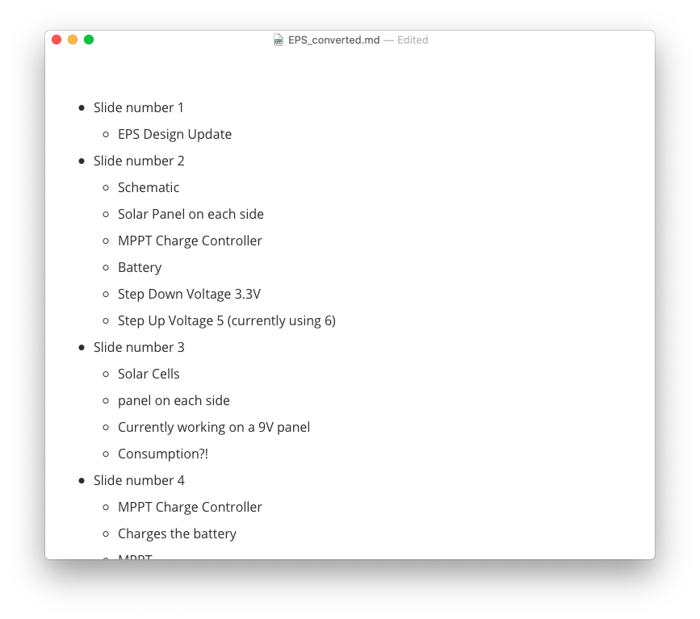

# PowerPoint_Markdown_converter
This is a CLI application that converts Powerpoint slides into Markdown. I built this with the idea of importing the final output to Roam Research. This influenced a lot of the design decisions (and probably will in future versions.) 

I created this thanks to [Rob Haisfield](https://github.com/classicrob) who floated the idea on one of Roam's Slack channels.

## Installation
Besides the `pptx2markdown.py` file, you might need to install some libraries for the script to run successfully. The script use the libraries below so make sure they're installed. I included the pip install command for each library in case you don't have them in your machine.

* Pillow

  * ```python
    pip install Pillow
    ```

* python-pptx

  * ```python
    pip install python-pptx
    ```

* Mdutils

  * ```python
    pip install mdutils
    ```

## Usage 
Running the script is very easy: 

- Move/Copy the powerpoint file to the same directory as the .py file
  - This is important. The two files need to be in the same folder.
- In your terminal, type `python pptx2markdown.py [powerpoint filename]`
  - Make sure to run the command from the same directory as the two files.

A folder named '[ppt filename]_converted' will be generated. in it, you'll find the generated markdown file and images folder.

## Output
The format outpul looks like this:



It doesn't matter how the powerpoint is structured, this is the final output. All texts whether they are titles or bullet points or simple text will be treated the same. More formatting can be applied in Roam Research itself. 

### Images

If there are images in the Powerpoint, they will be saved in a specific folder with the number of the slide they belong to in the title. Here's what the folder structure would look like after running 

Feedback is appreciated!


